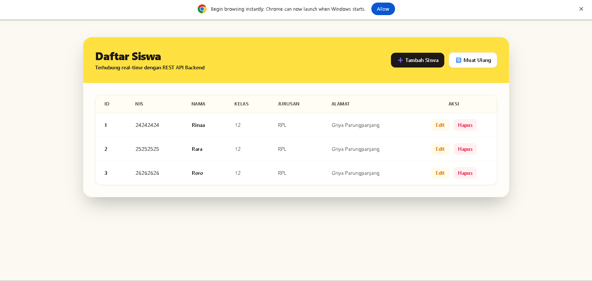

### Student Management System REST API

## 1. Nama Aplikasi
Student Management System REST API
---
## 2. Deskripsi Aplikasi
Student Management System REST API adalah aplikasi backend berbasis web yang dirancang untuk mengelola data akademik siswa secara digital. Sistem ini menyediakan layanan CRUD (*Create, Read, Update, Delete*) yang aman dan terstruktur untuk mengelola informasi siswa.
---
## 3. Teknologi yang Digunakan
Proyek ini dibangun menggunakan teknologi berikut:
* Runtime: Node.js
* Framework: Express.js
* Database: Mysql
* Tools: Postman (untuk testing API), Git & GitHub
---
## 4. Cara Menjalankan Backend
Ikuti langkah-langkah di bawah ini untuk menjalankan server backend di komputer lokal Anda:

1. Clone atau download repository ini ke komputer Anda.
2. Buka terminal atau command prompt, lalu masuk ke direktori folder backend proyek:
   ```bash
   cd student-management-api
   ```
3. Install semua dependencies yang dibutuhkan:
   ```bash
   npm install
   ```
4. Konfigurasi Environment Variable:
   Buat file baru bernama `.env` di folder utama (root), lalu isi dengan konfigurasi database dan server Anda (contoh):
   ```env
   PORT=5000
   DB_HOST=localhost
   DB_USER=postgres
   DB_PASS=passwordkamu
   DB_NAME=student_ms
   JWT_SECRET=rahasia_banget
   ```
5. Jalankan Migrasi Database (jika menggunakan ORM/Migration):
   ```bash
   npm run migrate
   ```
6. Jalankan Server Backend:
   ```bash
   # Mode Development (dengan nodemon)
   npm run dev

   # Mode Production
   npm start
   ```
---
## 5. Cara Menjalankan Frontend

1. Buka terminal baru, lalu masuk ke direktori folder frontend:
   ```bash
   cd frontend
   ```
2. Install dependencies frontend:
   ```bash
   npm install
   ```
3. Jalankan aplikasi frontend:
   ```bash
   npm run dev
   ```
4. Buka browser Anda dan akses URL frontend yang tertera di terminal
---
## 6. Daftar Endpoint API
### A. Manajemen Siswa
| Method | Endpoint | Deskripsi |
| :--- | :--- | :--- |
| `GET` | `/api/siswa` | Mendapatkan semua data siswa |
| `GET` | `/api/siswa/{id}` | Mendapatkan detail siswa berdasarkan ID |
| `POST` | `/api/siswa` | Menambah data siswa baru |
| `PUT` | `/api/siswa/{id}` | Mengubah data siswa berdasarkan ID |
| `DELETE` | `/api/siswa/{id}` | Menghapus data siswa |
---
## 7. Screenshot Aplikasi

---
## 8. Identitas Pembuat
* Nama:Rina Rusliana
* NIPD: 242510076
* Kelas: Rekayasa Perangkat Lunak
* Email: rinaruslianaaa09@gmail.com
* GitHub: [https://github.com/rinaa20]
